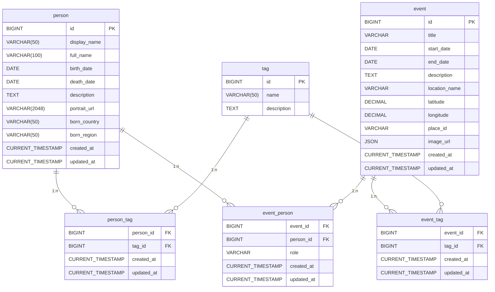

### テーブル

#### person
| 項目名            | 型           | 制約／補足                          | 説明                 |
| -------------- | ----------- | ------------------------------ | ------------------ |
| `id`           | `BIGINT`   | PK, AUTOINCREMENT              | レコードの一意識別子         |
| `ssid`         | `VARCHAR(50)` | GENERATED ALWAYS AS          | 検索用識別子（display_name_birthdate） |
| `full_name`    | `VARCHAR(100)` | NOT NULL                    | 歴史上の人物の名前(正式名称など) |
| `display_name` | `VARCHAR(50)` | NOT NULL                    | 歴史上の人物の名前(表示用) |
| `search_name`  | `VARCHAR(255)` | GENERATED ALWAYS AS         | 検索用文字列（全カラム結合） |
| `birth_date`   | `DATE`      | NOT NULL                       | 生年月日               |
| `death_date`   | `DATE`      | NULLABLE                       | 死亡日（存命人物の場合は NULL） |
| `born_country`   | `VARCHAR(100)`      | NOT NULL                       | 出生国 |
| `born_region`   | `VARCHAR(100)`      | NULLABLE                       |出生地域 |
| `description`  | `TEXT`      | NULLABLE                       | 人物の経歴・略歴など詳細説明     |
| `portrait_url` | `VARCHAR(2048)`   | NULLABLE                       | 肖像画や写真の URL        |
| `created_at`   | `CURRENT_TIMESTAMP` | DEFAULT now()                  | レコード作成日時           |
| `updated_at`   | `CURRENT_TIMESTAMP` | DEFAULT now(), ON UPDATE now() | レコード最終更新日時         |

#### tag
| 項目名            | 型           | 制約／補足                          | 説明                 |
| -------------- | ----------- | ------------------------------ | ------------------ |
| `id`           | `BIGINT`   | PK, AUTOINCREMENT              | レコードの一意識別子         |
| `ssid`         | `VARCHAR(50)` | GENERATED ALWAYS AS          | 検索用識別子（tag_name） |
| `name`         | `VARCHAR(50)` | NOT NULL                    | 時代・カテゴリなどを表すタグ名 |
| `created_at`   | `CURRENT_TIMESTAMP` | DEFAULT now()                  | レコード作成日時           |
| `updated_at`   | `CURRENT_TIMESTAMP` | DEFAULT now(), ON UPDATE now() | レコード最終更新日時         |

#### person_tag
| 項目名            | 型           | 制約／補足                          | 説明                 |
| -------------- | ----------- | ------------------------------ | ------------------ |
| `person_id`    | `BIGINT`   | PK, FK (person.id)             | 人物ID              |
| `tag_id`       | `BIGINT`   | PK, FK (tag.id)                | タグID              |
| `created_at`   | `CURRENT_TIMESTAMP` | DEFAULT now()                  | レコード作成日時           |
| `updated_at`   | `CURRENT_TIMESTAMP` | DEFAULT now(), ON UPDATE now() | レコード最終更新日時         |

#### event
| 項目名| 型| 制約／補足| 説明|
| -------------- | ----------- | --------- | ------------------ |
| `id`    | `BIGINT`   | PK, AUTOINCREMENT            | レコードの一意識別子|
| `ssid`  | `VARCHAR(50)` | GENERATED ALWAYS AS        | 検索用識別子（event_title_date） |
| `title`| `VARCHAR`   | NOT NULL               | 出来事の表題|
| `start_date`| `DATE`   | NOT NULL               | 出来事の開始日|
| `end_date`| `DATE`   | NULLABLE| 出来事の終了日(単日の場合は NULL)|
| `description`| `TEXT`   | NULLABLE| 出来事の背景・詳細説明|
| `location_name`| `VARCHAR(255)`   | NULLABLE| 場所の名称|
| `latitude`| `DECIMAL(10,8)`   | NULLABLE| 緯度（-90.00000000 から 90.00000000）|
| `longitude`| `DECIMAL(11,8)`   | NULLABLE| 経度（-180.00000000 から 180.00000000）|
| `place_id`| `VARCHAR(255)`   | NULLABLE| Google Places APIのplace_id|
| `image_url`| `JSON`   | NULLABLE (JSON 配列やカンマ区切り等)| 関連画像の URL|
| `created_at`   | `CURRENT_TIMESTAMP` | DEFAULT now()| レコード作成日時|
| `updated_at`   | `CURRENT_TIMESTAMP` | DEFAULT now(), ON UPDATE now() | レコード最終更新日時|

#### event_tag
| 項目名            | 型           | 制約／補足                          | 説明                 |
| -------------- | ----------- | ------------------------------ | ------------------ |
| `event_id`     | `BIGINT`   | PK, FK (event.id)              | 出来事ID            |
| `tag_id`       | `BIGINT`   | PK, FK (tag.id)                | タグID              |
| `created_at`   | `CURRENT_TIMESTAMP` | DEFAULT now()                  | レコード作成日時           |
| `updated_at`   | `CURRENT_TIMESTAMP` | DEFAULT now(), ON UPDATE now() | レコード最終更新日時         |

#### event_person
| 項目名            | 型           | 制約／補足                          | 説明                 |
| -------------- | ----------- | ------------------------------ | ------------------ |
| `event_id`     | `BIGINT`   | PK, FK (event.id)              | 出来事ID            |
| `person_id`    | `BIGINT`   | PK, FK (person.id)             | 人物ID              |
| `role`         | `VARCHAR(50)` | NULLABLE                    | 出来事における役割（例：主役、関係者など） |
| `created_at`   | `CURRENT_TIMESTAMP` | DEFAULT now()                  | レコード作成日時           |
| `updated_at`   | `CURRENT_TIMESTAMP` | DEFAULT now(), ON UPDATE now() | レコード最終更新日時         |

### ER図



## インデックス

### 作成するインデックスの一覧
#### person
- `idx_person_display_name` (display_name)
- `idx_person_full_name` (full_name)
- `idx_person_search_name` (search_name)
- `idx_person_birth_death` (birth_date, death_date)

#### tag
- `idx_tag_name` (name)

#### event
- `idx_event_title` (title)
- `idx_event_location_name` (location_name)
- `idx_event_dates` (start_date, end_date)

#### event_person
- `idx_event_person_event` (event_id)
- `idx_event_person_person` (person_id)
- `idx_event_person_role` (role)

### インデックスの作成
1. 検索用インデックスの作成
    ```sql
    -- 人物名の検索用インデックス
    CREATE INDEX idx_person_display_name ON person (display_name);
    CREATE INDEX idx_person_full_name ON person (full_name);

    -- タグ名の検索用インデックス
    CREATE INDEX idx_tag_name ON tag (name);

    -- 出来事の検索用インデックス
    CREATE INDEX idx_event_title ON event (title);
    CREATE INDEX idx_event_location_name ON event (location_name);

    -- 複合インデックス（よく使う検索条件の組み合わせ）
    CREATE INDEX idx_person_birth_death ON person (birth_date, death_date);
    CREATE INDEX idx_event_dates ON event (start_date, end_date);

    -- 出来事と人物の関連の検索用インデックス
    CREATE INDEX idx_event_person_event ON event_person (event_id);
    CREATE INDEX idx_event_person_person ON event_person (person_id);
    CREATE INDEX idx_event_person_role ON event_person (role);
    ```
    - 表示名と正式名称で検索する際の速度を向上
    - `WHERE display_name LIKE '%検索文字%'` のような検索が高速化
    - タグ名での検索を高速化
    - タグの一覧表示や検索時のパフォーマンス向上
    - 出来事のタイトルと場所名での検索を高速化
    - 日付範囲での検索を高速化
    - 例：`WHERE birth_date BETWEEN '1900-01-01' AND '2000-12-31'`
1. 表示名の検索最適化
    ```sql
    -- 人物テーブルに検索用カラムを追加
    ALTER TABLE person ADD COLUMN search_name VARCHAR(255) GENERATED ALWAYS AS (
      LOWER(CONCAT(
        COALESCE(display_name, ''),
        ' ',
        COALESCE(full_name, ''),
        ' ',
        COALESCE(born_country, ''),
        ' ',
        COALESCE(born_region, '')
      ))
    ) STORED;

    -- 検索用インデックス
    CREATE INDEX idx_person_search_name ON person (search_name);
    ```
    - 検索用の仮想カラムを作成
    - 複数のカラムを結合して1つの検索文字列に
    - `LOWER()`: 大文字小文字を区別しない検索のため
    - `COALESCE()`: NULL値を空文字に変換
    - `STORED`: 物理的に保存（検索速度向上のため）
    - 生成した検索用カラムにインデックスを作成
    - 複数カラムを組み合わせた検索を高速化
1. SSIDの追加
    ```sql
    -- 人物テーブルにSSIDを追加
    ALTER TABLE person ADD COLUMN ssid VARCHAR(50) GENERATED ALWAYS AS (
      CONCAT(
        SUBSTRING(REPLACE(LOWER(display_name), ' ', '_'), 1, 20),
        '_',
        DATE_FORMAT(birth_date, '%Y%m%d')
      )
    ) STORED;
    ```
    - 人物の識別子を生成（例：toyotomi_hideyoshi_15370317）
    - REPLACE(): スペースをアンダースコアに変換
    - SUBSTRING(): 長さを制限
    - DATE_FORMAT(): 日付を文字列に変換

    ```sql
    -- タグテーブルにSSIDを追加
    ALTER TABLE tag ADD COLUMN ssid VARCHAR(50) GENERATED ALWAYS AS (
      CONCAT(
        'tag_',
        SUBSTRING(REPLACE(LOWER(name), ' ', '_'), 1, 30)
      )
    ) STORED;
    ```
    - タグの識別子を生成（例：tag_warring_states_period）
    - プレフィックスtag_を付加して識別を容易に

    ```sql
    -- 出来事テーブルにSSIDを追加
    ALTER TABLE event ADD COLUMN ssid VARCHAR(50) GENERATED ALWAYS AS (
      CONCAT(
        'event_',
        SUBSTRING(REPLACE(LOWER(title), ' ', '_'), 1, 20),
        '_',
        DATE_FORMAT(start_date, '%Y%m%d')
      )
    ) STORED;
    ```
    - 出来事の識別子を生成（例：`event_battle_of_sekigahara_16001021`）
    - タイトルと日付を組み合わせて一意性を確保

## 参考 SQL
```sql
-- 特定の出来事に関連する人物を取得
SELECT p.* FROM person p
JOIN event_person ep ON p.id = ep.person_id
WHERE ep.event_id = 123;

-- 特定の人物に関連する出来事を取得
SELECT e.* FROM event e
JOIN event_person ep ON e.id = ep.event_id
WHERE ep.person_id = 456;

-- 特定の役割の人物を取得
SELECT p.* FROM person p
JOIN event_person ep ON p.id = ep.person_id
WHERE ep.role = '主役';
```