# 04. シーケンス図

## 📋 概要

このドキュメントでは、認証・認可システムの主要なフローのシーケンス図を提供します。各フローの詳細な処理手順とコンポーネント間の相互作用を視覚的に理解できます。

## 🔐 認証フロー

### 1. ユーザー登録フロー

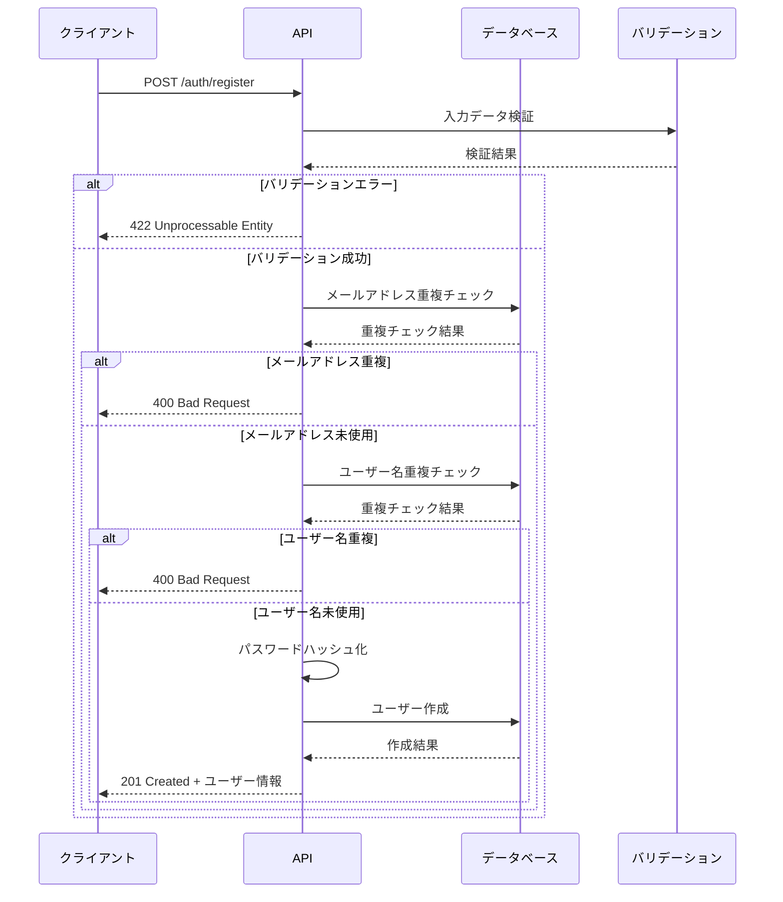
```mermaid
sequenceDiagram
    participant C as クライアント
    participant A as API
    participant D as データベース
    participant V as バリデーション

    C->>A: POST /auth/register
    A->>V: 入力データ検証
    V-->>A: 検証結果
    
    alt バリデーションエラー
        A-->>C: 422 Unprocessable Entity
    else バリデーション成功
        A->>D: メールアドレス重複チェック
        D-->>A: 重複チェック結果
        
        alt メールアドレス重複
            A-->>C: 400 Bad Request
        else メールアドレス未使用
            A->>D: ユーザー名重複チェック
            D-->>A: 重複チェック結果
            
            alt ユーザー名重複
                A-->>C: 400 Bad Request
            else ユーザー名未使用
                A->>A: パスワードハッシュ化
                A->>D: ユーザー作成
                D-->>A: 作成結果
                A-->>C: 201 Created + ユーザー情報
            end
        end
    end
```

### 2. ログインフロー

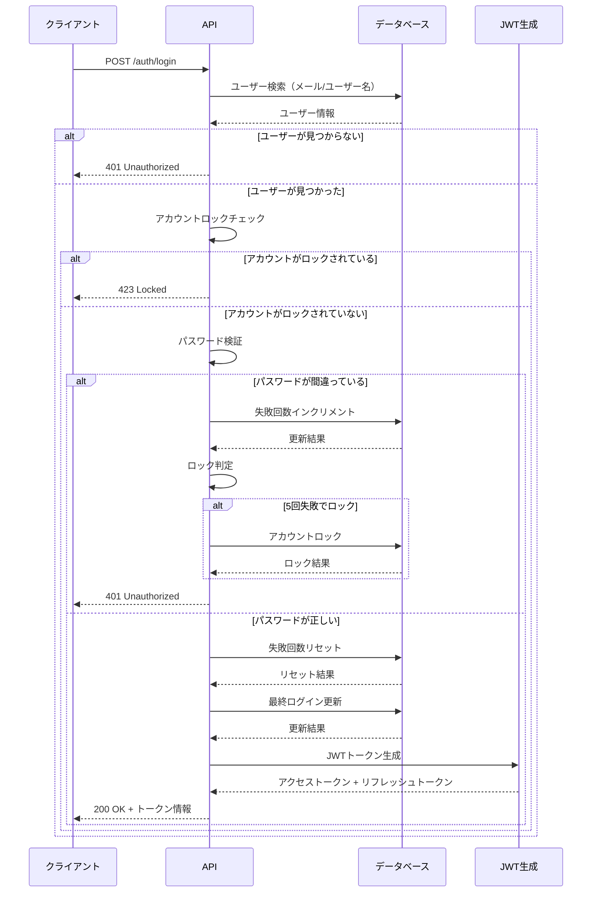
```mermaid
sequenceDiagram
    participant C as クライアント
    participant A as API
    participant D as データベース
    participant J as JWT生成

    C->>A: POST /auth/login
    A->>D: ユーザー検索（メール/ユーザー名）
    D-->>A: ユーザー情報
    
    alt ユーザーが見つからない
        A-->>C: 401 Unauthorized
    else ユーザーが見つかった
        A->>A: アカウントロックチェック
        
        alt アカウントがロックされている
            A-->>C: 423 Locked
        else アカウントがロックされていない
            A->>A: パスワード検証
            
            alt パスワードが間違っている
                A->>D: 失敗回数インクリメント
                D-->>A: 更新結果
                A->>A: ロック判定
                
                alt 5回失敗でロック
                    A->>D: アカウントロック
                    D-->>A: ロック結果
                end
                
                A-->>C: 401 Unauthorized
            else パスワードが正しい
                A->>D: 失敗回数リセット
                D-->>A: リセット結果
                A->>D: 最終ログイン更新
                D-->>A: 更新結果
                A->>J: JWTトークン生成
                J-->>A: アクセストークン + リフレッシュトークン
                A-->>C: 200 OK + トークン情報
            end
        end
    end
```

### 3. APIアクセスフロー（JWT認証）

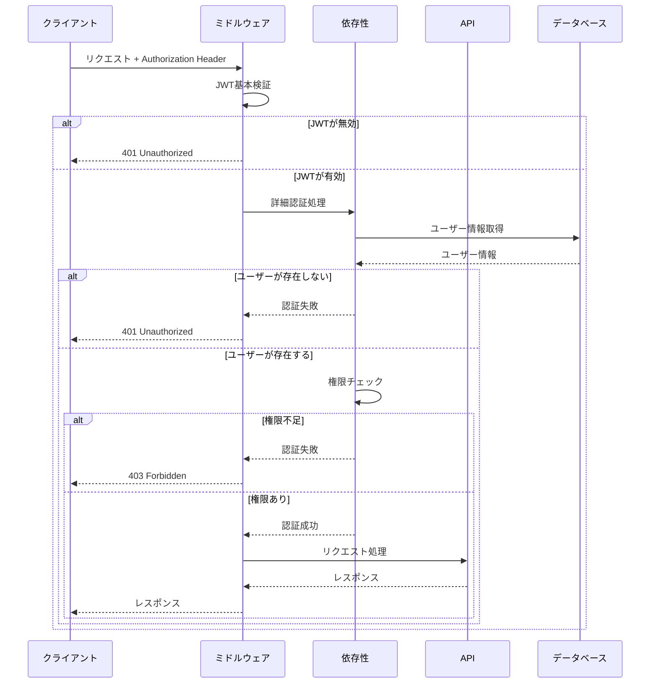
```mermaid
sequenceDiagram
    participant C as クライアント
    participant M as ミドルウェア
    participant D as 依存性
    participant A as API
    participant DB as データベース

    C->>M: リクエスト + Authorization Header
    M->>M: JWT基本検証
    
    alt JWTが無効
        M-->>C: 401 Unauthorized
    else JWTが有効
        M->>D: 詳細認証処理
        D->>DB: ユーザー情報取得
        DB-->>D: ユーザー情報
        
        alt ユーザーが存在しない
            D-->>M: 認証失敗
            M-->>C: 401 Unauthorized
        else ユーザーが存在する
            D->>D: 権限チェック
            
            alt 権限不足
                D-->>M: 認証失敗
                M-->>C: 403 Forbidden
            else 権限あり
                D-->>M: 認証成功
                M->>A: リクエスト処理
                A-->>M: レスポンス
                M-->>C: レスポンス
            end
        end
    end
```

### 4. APIアクセスフロー（APIキー認証）

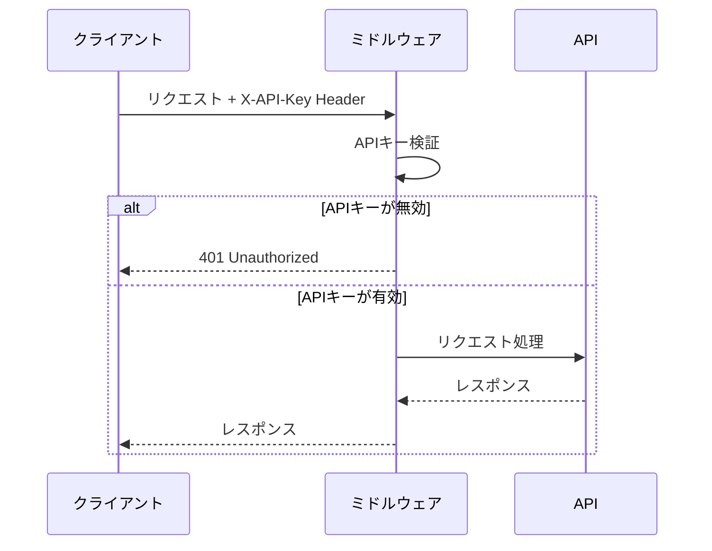
```mermaid
sequenceDiagram
    participant C as クライアント
    participant M as ミドルウェア
    participant A as API

    C->>M: リクエスト + X-API-Key Header
    M->>M: APIキー検証
    
    alt APIキーが無効
        M-->>C: 401 Unauthorized
    else APIキーが有効
        M->>A: リクエスト処理
        A-->>M: レスポンス
        M-->>C: レスポンス
    end
```

### 5. トークン更新フロー

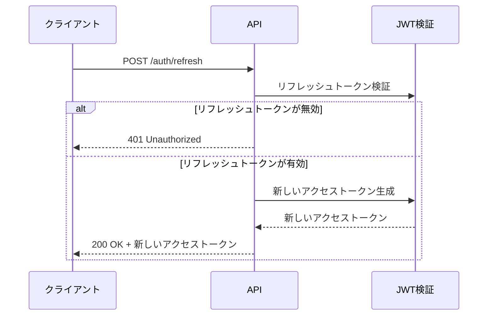
```mermaid
sequenceDiagram
    participant C as クライアント
    participant A as API
    participant J as JWT検証

    C->>A: POST /auth/refresh
    A->>J: リフレッシュトークン検証
    
    alt リフレッシュトークンが無効
        A-->>C: 401 Unauthorized
    else リフレッシュトークンが有効
        A->>J: 新しいアクセストークン生成
        J-->>A: 新しいアクセストークン
        A-->>C: 200 OK + 新しいアクセストークン
    end
```

### 6. ユーザー情報更新フロー

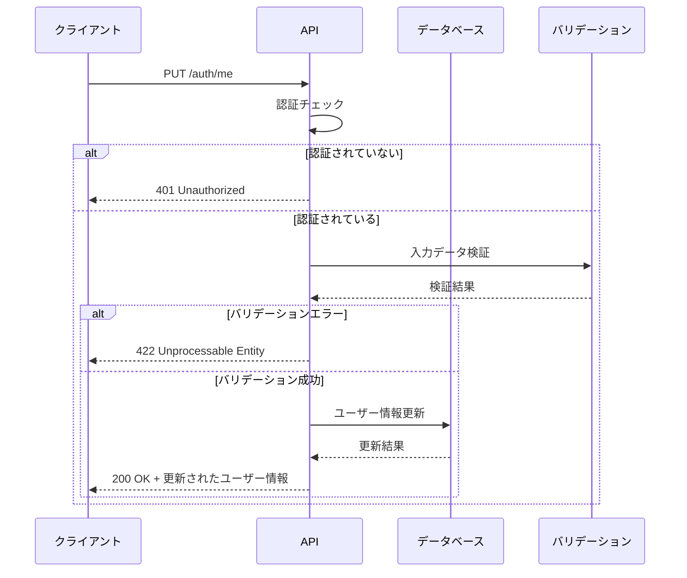
```mermaid
sequenceDiagram
    participant C as クライアント
    participant A as API
    participant D as データベース
    participant V as バリデーション

    C->>A: PUT /auth/me
    A->>A: 認証チェック
    
    alt 認証されていない
        A-->>C: 401 Unauthorized
    else 認証されている
        A->>V: 入力データ検証
        V-->>A: 検証結果
        
        alt バリデーションエラー
            A-->>C: 422 Unprocessable Entity
        else バリデーション成功
            A->>D: ユーザー情報更新
            D-->>A: 更新結果
            A-->>C: 200 OK + 更新されたユーザー情報
        end
    end
```

## 👥 ユーザー管理フロー

### 1. ユーザー一覧取得フロー

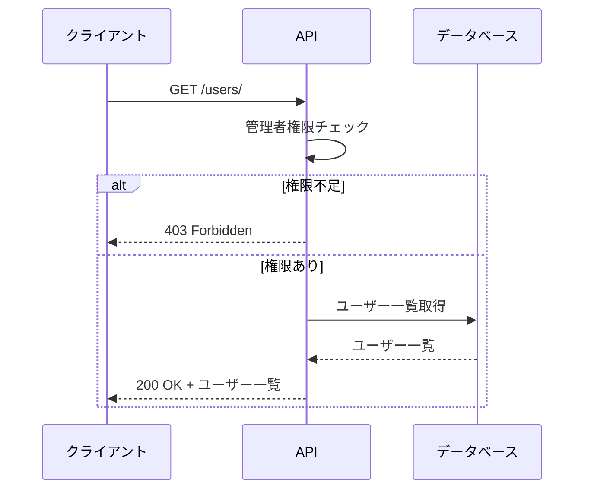
```mermaid
sequenceDiagram
    participant C as クライアント
    participant A as API
    participant D as データベース

    C->>A: GET /users/
    A->>A: 管理者権限チェック
    
    alt 権限不足
        A-->>C: 403 Forbidden
    else 権限あり
        A->>D: ユーザー一覧取得
        D-->>A: ユーザー一覧
        A-->>C: 200 OK + ユーザー一覧
    end
```

### 2. ユーザー詳細取得フロー

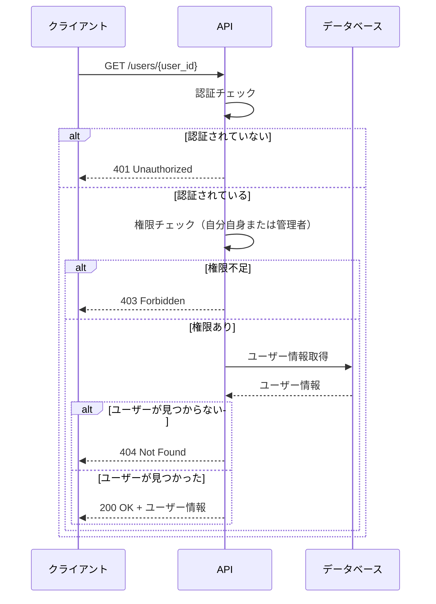
```mermaid
sequenceDiagram
    participant C as クライアント
    participant A as API
    participant D as データベース

    C->>A: GET /users/{user_id}
    A->>A: 認証チェック
    
    alt 認証されていない
        A-->>C: 401 Unauthorized
    else 認証されている
        A->>A: 権限チェック（自分自身または管理者）
        
        alt 権限不足
            A-->>C: 403 Forbidden
        else 権限あり
            A->>D: ユーザー情報取得
            D-->>A: ユーザー情報
            
            alt ユーザーが見つからない
                A-->>C: 404 Not Found
            else ユーザーが見つかった
                A-->>C: 200 OK + ユーザー情報
            end
        end
    end
```

### 3. ユーザー更新フロー

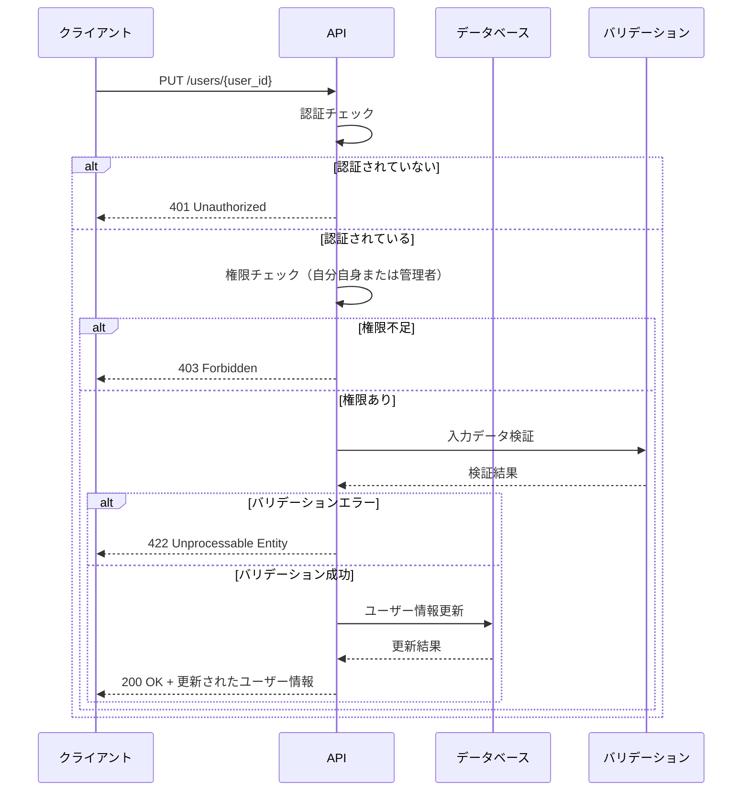
```mermaid
sequenceDiagram
    participant C as クライアント
    participant A as API
    participant D as データベース
    participant V as バリデーション

    C->>A: PUT /users/{user_id}
    A->>A: 認証チェック
    
    alt 認証されていない
        A-->>C: 401 Unauthorized
    else 認証されている
        A->>A: 権限チェック（自分自身または管理者）
        
        alt 権限不足
            A-->>C: 403 Forbidden
        else 権限あり
            A->>V: 入力データ検証
            V-->>A: 検証結果
            
            alt バリデーションエラー
                A-->>C: 422 Unprocessable Entity
            else バリデーション成功
                A->>D: ユーザー情報更新
                D-->>A: 更新結果
                A-->>C: 200 OK + 更新されたユーザー情報
            end
        end
    end
```

### 4. ユーザー削除フロー

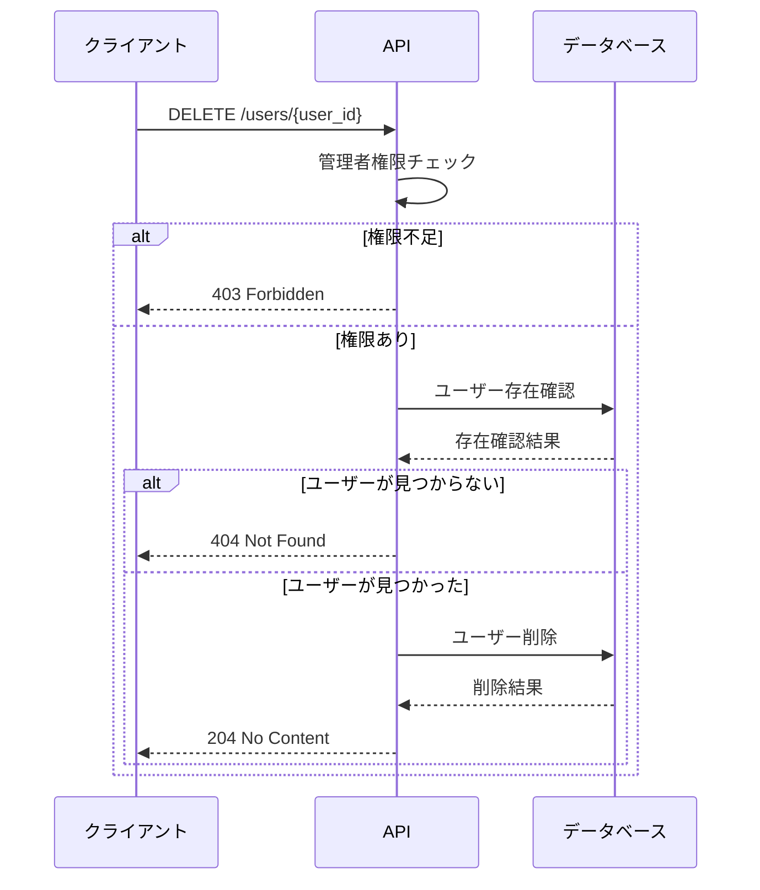
```mermaid
sequenceDiagram
    participant C as クライアント
    participant A as API
    participant D as データベース

    C->>A: DELETE /users/{user_id}
    A->>A: 管理者権限チェック
    
    alt 権限不足
        A-->>C: 403 Forbidden
    else 権限あり
        A->>D: ユーザー存在確認
        D-->>A: 存在確認結果
        
        alt ユーザーが見つからない
            A-->>C: 404 Not Found
        else ユーザーが見つかった
            A->>D: ユーザー削除
            D-->>A: 削除結果
            A-->>C: 204 No Content
        end
    end
```

## 🔒 セキュリティフロー

### 1. アカウントロックフロー

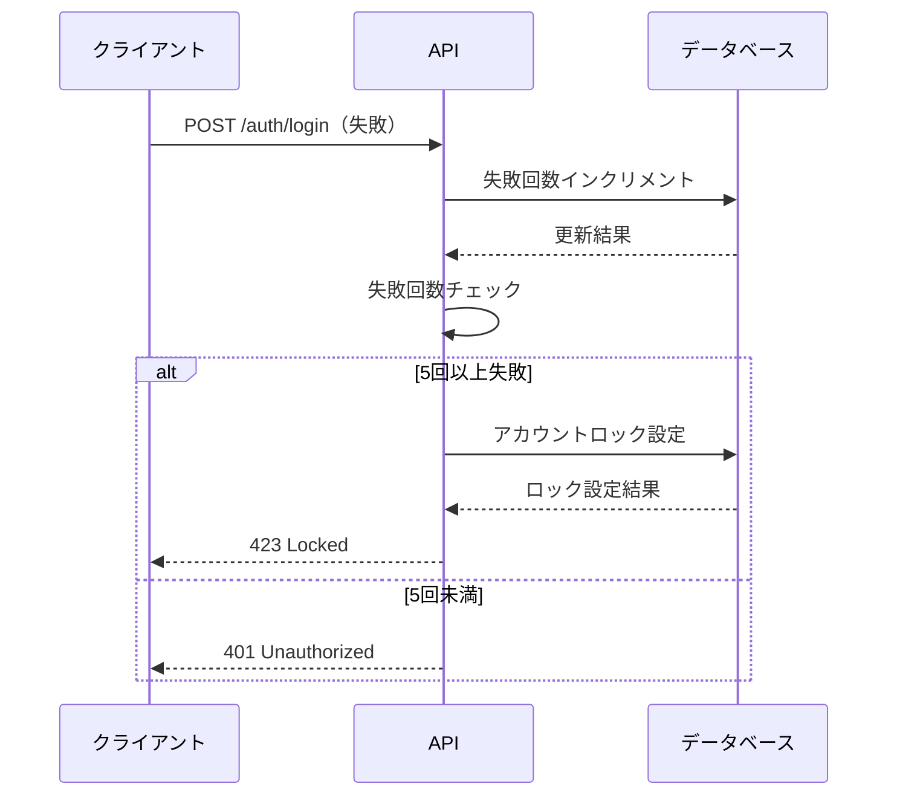
```mermaid
sequenceDiagram
    participant C as クライアント
    participant A as API
    participant D as データベース

    C->>A: POST /auth/login（失敗）
    A->>D: 失敗回数インクリメント
    D-->>A: 更新結果
    A->>A: 失敗回数チェック
    
    alt 5回以上失敗
        A->>D: アカウントロック設定
        D-->>A: ロック設定結果
        A-->>C: 423 Locked
    else 5回未満
        A-->>C: 401 Unauthorized
    end
```

### 2. アカウントロック解除フロー

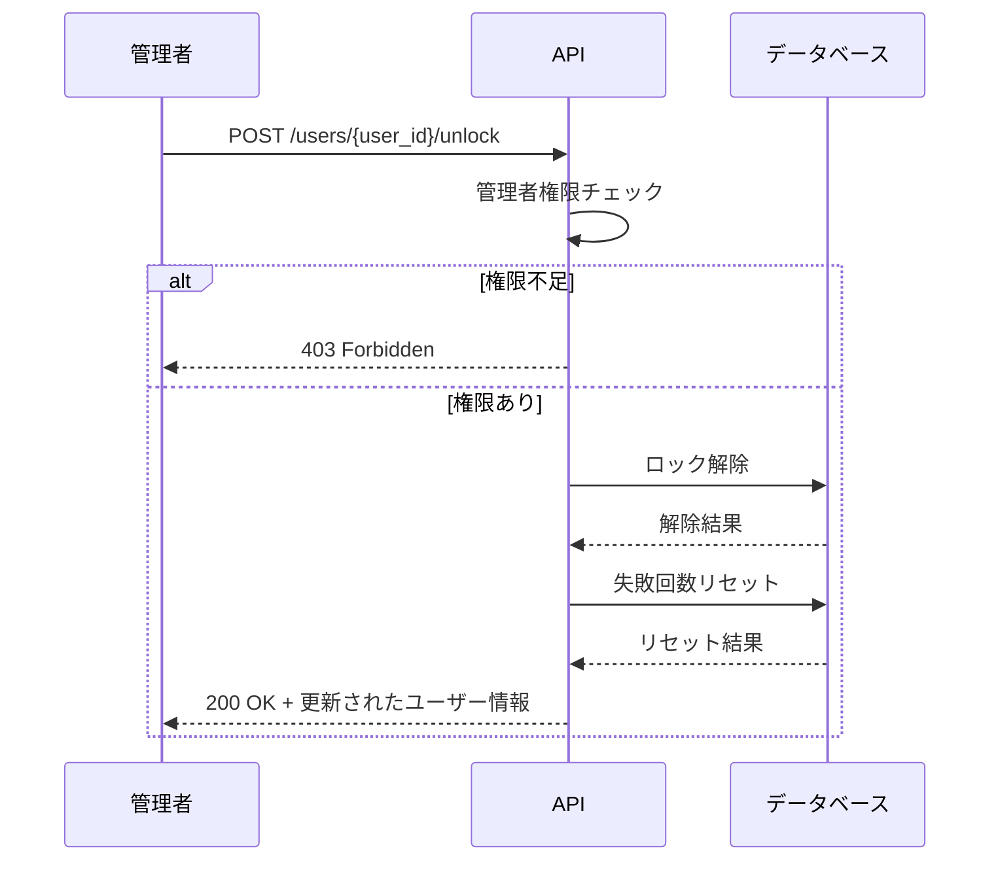
```mermaid
sequenceDiagram
    participant A as 管理者
    participant API as API
    participant D as データベース

    A->>API: POST /users/{user_id}/unlock
    API->>API: 管理者権限チェック
    
    alt 権限不足
        API-->>A: 403 Forbidden
    else 権限あり
        API->>D: ロック解除
        D-->>API: 解除結果
        API->>D: 失敗回数リセット
        D-->>API: リセット結果
        API-->>A: 200 OK + 更新されたユーザー情報
    end
```

## 📊 統計・分析フロー

### 1. ユーザー統計取得フロー

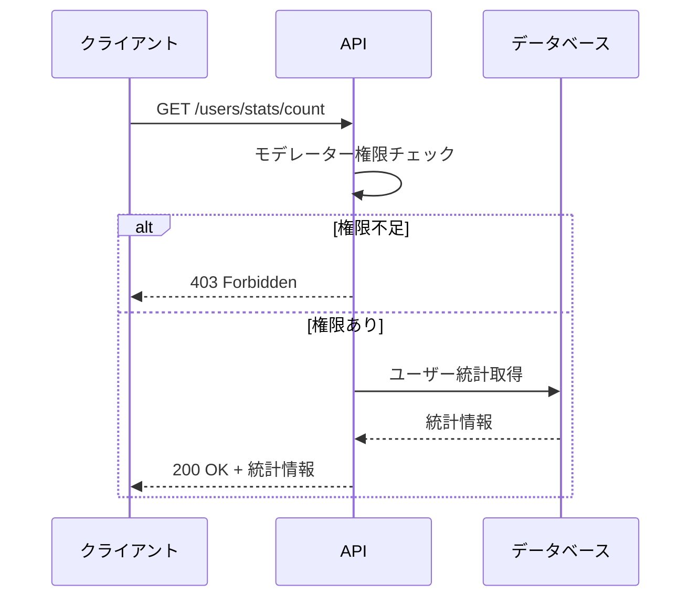
```mermaid
sequenceDiagram
    participant C as クライアント
    participant A as API
    participant D as データベース

    C->>A: GET /users/stats/count
    A->>A: モデレーター権限チェック
    
    alt 権限不足
        A-->>C: 403 Forbidden
    else 権限あり
        A->>D: ユーザー統計取得
        D-->>A: 統計情報
        A-->>C: 200 OK + 統計情報
    end
```

## 🔄 エラーハンドリングフロー

### 1. 認証エラーハンドリング

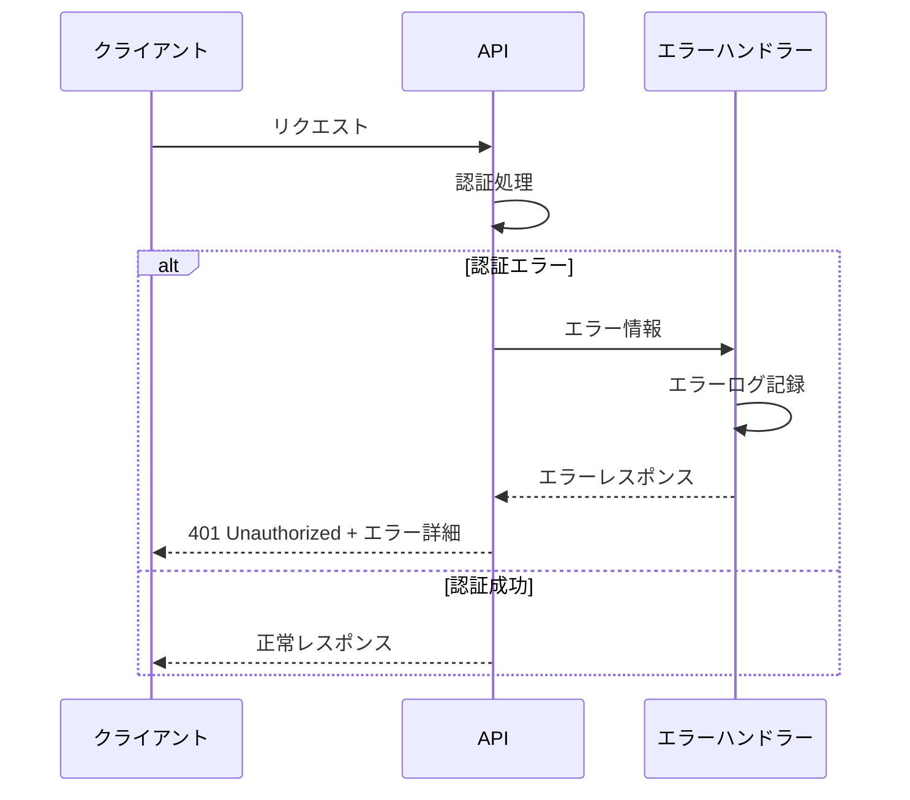
```mermaid
sequenceDiagram
    participant C as クライアント
    participant A as API
    participant E as エラーハンドラー

    C->>A: リクエスト
    A->>A: 認証処理
    
    alt 認証エラー
        A->>E: エラー情報
        E->>E: エラーログ記録
        E-->>A: エラーレスポンス
        A-->>C: 401 Unauthorized + エラー詳細
    else 認証成功
        A-->>C: 正常レスポンス
    end
```

### 2. 権限エラーハンドリング

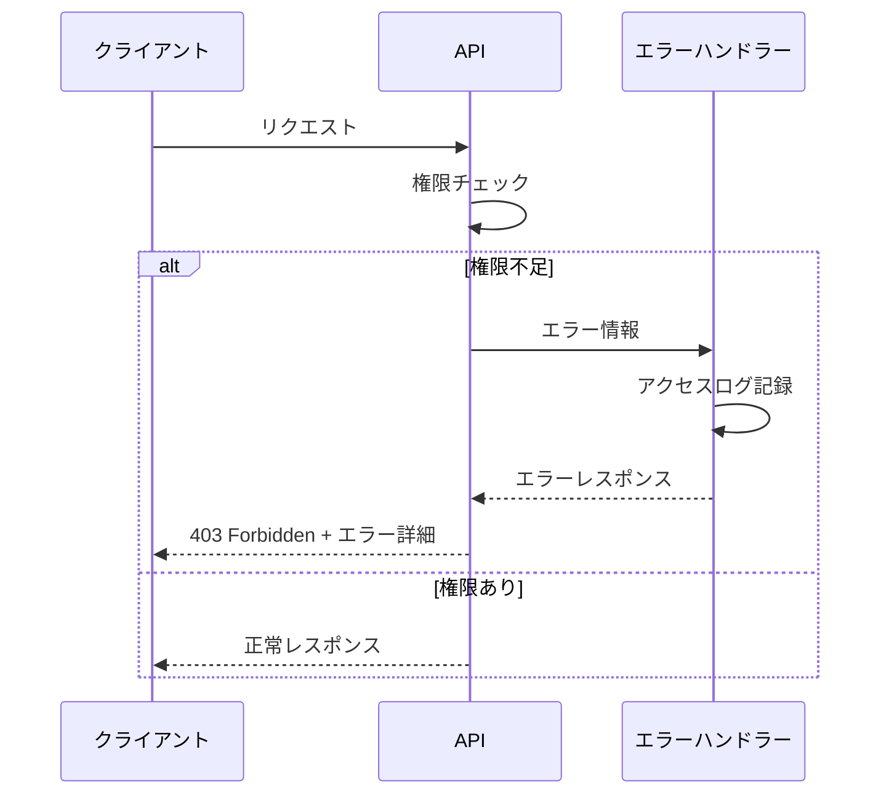
```mermaid
sequenceDiagram
    participant C as クライアント
    participant A as API
    participant E as エラーハンドラー

    C->>A: リクエスト
    A->>A: 権限チェック
    
    alt 権限不足
        A->>E: エラー情報
        E->>E: アクセスログ記録
        E-->>A: エラーレスポンス
        A-->>C: 403 Forbidden + エラー詳細
    else 権限あり
        A-->>C: 正常レスポンス
    end
```

## 🔗 関連ドキュメント

- [01. 認証システム概要](./01-認証システム概要.md)
- [02. データベース設計](./02-データベース設計.md)
- [03. API仕様書](./03-API仕様書.md)
- [05. 実装ガイド](./05-実装ガイド.md) 